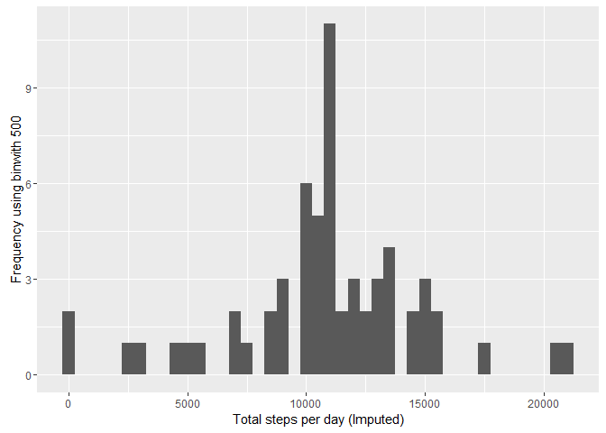

# RepReserach-PA1


# Reproducible Research: Peer Assessment 1

library(ggplot2)
library(scales)
library(Hmisc)

## Loading and preprocessing the data
### 1. Load the data (i.e. read.csv())


```r
setwd('C:/Users/Home/Downloads/Coursera-DS/Course5-ReproducibleResearch/Lesson2')

if(!file.exists('activity.csv')){
    unzip('activity.zip')
}
actdata <- read.csv('activity.csv')
```

### 2. Process/transform the data (if necessary) into a format suitable for your analysis


```r
#actdata$interval <- strptime(gsub("([0-9]{1,2})([0-9]{2})", "\\1:\\2", actdata$interval), format='%H:%M')
```

## What is mean total number of steps taken per day?


```r
stepsByDay <- tapply(actdata$steps, actdata$date, sum, na.rm=TRUE)
```

### 1. Make a histogram of the total number of steps taken each day


```r
library(ggplot2)
qplot(stepsByDay, xlab='Total steps per day', ylab='Frequency using binwith 500', binwidth=500)
```

<!-- -->

### 2. Calculate and report the mean and median total number of steps taken per day


```r
stepsByDayMean <- mean(stepsByDay)
stepsByDayMedian <- median(stepsByDay)

#  Mean: r 
stepsByDayMean
```

```
## [1] 9354.23
```

```r
#  Median: r 
stepsByDayMedian
```

```
## [1] 10395
```

## What is the average daily activity pattern?


```r
averageStepsPerTimeBlock <- aggregate(x=list(meanSteps=actdata$steps), by=list(interval=actdata$interval), FUN=mean, na.rm=TRUE)
```

1. Make a time series plot


```r
ggplot(data=averageStepsPerTimeBlock, aes(x=interval, y=meanSteps)) +
    geom_line() +
    xlab("5-minute interval") +
    ylab("average number of steps taken") 
```

<!-- -->

2. Which 5-minute interval, on average across all the days in the dataset, contains the maximum number of steps?


```r
mostSteps <- which.max(averageStepsPerTimeBlock$meanSteps)
timeMostSteps <-  gsub("([0-9]{1,2})([0-9]{2})", "\\1:\\2", averageStepsPerTimeBlock[mostSteps,'interval'])
```
Most Steps at: r 
 
 ```r
 timeMostSteps
 ```
 
 ```
 ## [1] "8:35"
 ```

## Imputing missing values
1. Calculate and report the total number of missing values in the dataset


```r
numMissingValues <- length(which(is.na(actdata$steps)))
```
    Number of missing values: r 


```r
    numMissingValues
```

```
## [1] 2304
```

2. Devise a strategy for filling in all of the missing values in the dataset.
3. Create a new dataset that is equal to the original dataset but with the missing data filled in.


```r
library(Hmisc)
```

```
## Loading required package: lattice
```

```
## Loading required package: survival
```

```
## Loading required package: Formula
```

```
## 
## Attaching package: 'Hmisc'
```

```
## The following objects are masked from 'package:base':
## 
##     format.pval, round.POSIXt, trunc.POSIXt, units
```

```r
actdataImputed <- actdata
actdataImputed$steps <- impute(actdata$steps, fun=mean)
```

4. Make a histogram of the total number of steps taken each day


```r
stepsByDayImputed <- tapply(actdataImputed$steps, actdataImputed$date, sum)
qplot(stepsByDayImputed, xlab='Total steps per day (Imputed)', ylab='Frequency using binwith 500', binwidth=500)
```

<!-- -->

... and Calculate and report the mean and median total number of steps taken per day.


```r
stepsByDayMeanImputed <- mean(stepsByDayImputed)
stepsByDayMedianImputed <- median(stepsByDayImputed)
```
    Mean (Imputed): r 

```r
    stepsByDayMeanImputed
```

```
## [1] 10766.19
```

    Median (Imputed): r 

```r
    stepsByDayMedianImputed
```

```
## [1] 10766.19
```

    ## Are there differences in activity patterns between weekdays and weekends?
1. Create a new factor variable in the dataset with two levels - "weekday" and "weekend" indicating whether a given date is a weekday or weekend day.


```r
actdataImputed$dateType <-  ifelse(as.POSIXlt(actdataImputed$date)$wday %in% c(0,6), 'weekend', 'weekday')
```

2. Make a panel plot containing a time series plot


```r
averagedactdataImputed <- aggregate(steps ~ interval + dateType, data=actdataImputed, mean)
ggplot(averagedactdataImputed, aes(interval, steps)) + 
    geom_line() + 
    facet_grid(dateType ~ .) +
    xlab("5-minute interval") + 
    ylab("avarage number of steps")
```

<!-- -->
